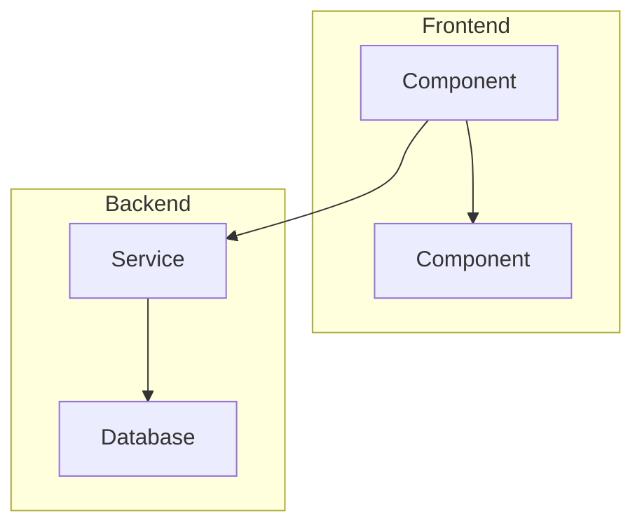
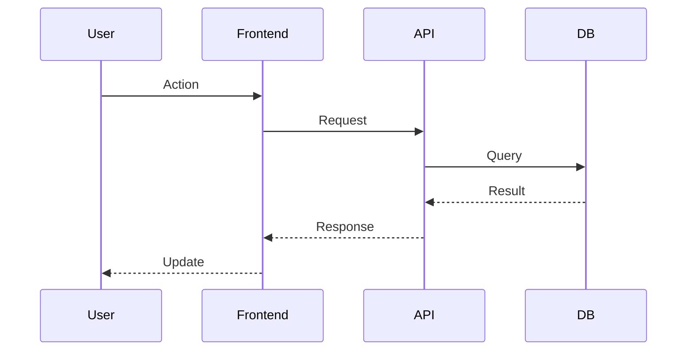
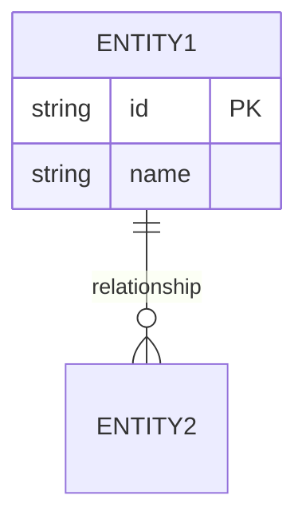

# PRD Generator: $ARGUMENTS.concept

Generate a comprehensive, research-backed Product Requirements Document ready for `task-master parse-prd`. This is NOT a planning command — it produces a structured PRD document with real technology research.

## Phase 1: Requirements Clarification

Before researching, clarify the concept with the user:

1. **Restate** the concept in your own words
2. **Identify gaps** — what's ambiguous or underspecified?
3. **Ask 2-4 targeted questions** covering:
   - Target users / use cases
   - Scale expectations (MVP vs production-grade)
   - Technology preferences or constraints
   - Integration points with existing systems
4. **Wait for answers** before proceeding to Phase 2

If the concept is already detailed enough (>200 words with clear requirements), skip to Phase 2 with a brief confirmation.

## Phase 2: Deep Technology Research

Research the technologies needed to implement this concept. Use the token-conscious tier system:

### 2.1 Technology Identification

From the clarified requirements, list:
- **Core technologies** needed (frameworks, databases, APIs)
- **Supporting libraries** (auth, payments, file handling, etc.)
- **Infrastructure** (hosting, CI/CD, monitoring)

### 2.2 Tiered Documentation Lookup

For EACH identified technology, apply the appropriate tier:

**Tier 1 — Existing knowledge** (stable, well-known):
- Use for: Python stdlib, React basics, PostgreSQL fundamentals, REST conventions
- No tool calls needed

**Tier 2 — WebFetch** (specific API lookups):
- Use for: Current version numbers, specific endpoint docs, configuration options
- Target official docs pages directly

**Tier 2.5 — llms.txt** (comprehensive library docs):
- Try: `WebFetch <docs-site>/llms.txt` for LLM-optimized documentation
- Many modern frameworks expose this (Astro, Hono, Supabase, etc.)
- More complete than single-page WebFetch, cheaper than Context7

**Tier 3 — Context7** (complex multi-part queries):
- Reserve for: Unfamiliar libraries, complex integration patterns, code examples
- Use `resolve-library-id` first, then `query-docs`
- Maximum 3 Context7 calls per PRD generation

### 2.3 Parallel Research

Use sub-agents (Task tool with Explore type) for parallel technology research when 3+ technologies need investigation. Each sub-agent researches one technology domain and returns:
- Current stable version
- Key API patterns relevant to the concept
- Known gotchas or limitations
- Recommended alternatives (if any)

### 2.4 Compile Documentation Clips

For each core technology, extract a **concrete documentation clip** (not hallucinated):
```
### [Technology Name] — Key API Reference
Source: [URL or "Context7: /org/lib"]
Version: [current stable]

[2-5 relevant code snippets or API signatures]

Gotchas:
- [Known issue or limitation]
```

## Phase 3: Architecture Design

### 3.1 System Architecture

Create a **mermaid diagram** showing the high-level system architecture:



### 3.2 Data Flow

Create a **mermaid sequence diagram** for the primary user flow:



### 3.3 Data Model (if applicable)

Create a **mermaid ER diagram** for core entities:



### 3.4 Architecture Decisions

For each significant decision, document:
- **Decision**: What was chosen
- **Alternatives considered**: What else was evaluated
- **Rationale**: Why this choice (backed by Phase 2 research)

### 3.5 Dependency Graph

This is the **most valuable section for `task-master parse-prd`**. Explicit dependency chains produce dramatically better task ordering than prose where dependencies must be inferred.

Organize modules/features into dependency layers:

1. **Foundation Layer (no dependencies)** — things that must exist first (config, base types, error handling, environment setup)
2. **Data/Integration Layer** — connects to external systems (databases, APIs, file systems). Depends on Foundation.
3. **Core Logic Layer** — business logic, processing, orchestration. Depends on Data layer.
4. **Presentation/Output Layer** — user-facing, reporting, notifications. Depends on Core.

Rules:
- Foundation modules have **NO** dependencies
- Every non-foundation module explicitly states `Depends on [X, Y]`
- Modules within the same layer that don't depend on each other **can be parallelized** by Task Master
- No circular dependencies — if A depends on B, B cannot depend on A

Example:
```
Foundation Layer (no dependencies):
  - Config Manager: Loads environment variables and API keys
  - Base Error Types: Defines exception hierarchy for the project

Data Layer:
  - Google Sheets Connector: Depends on [Config Manager, Base Error Types]
  - Postiz API Client: Depends on [Config Manager, Base Error Types]

Core Layer:
  - AI Caption Engine: Depends on [Config Manager, Base Error Types]
  - Workflow Runner: Depends on [Google Sheets Connector, Postiz API Client, AI Caption Engine]
```

**Why this matters:** Without explicit dependencies, `parse-prd` must guess at task ordering. With them, Task Master produces a proper DAG (directed acyclic graph) where foundation tasks are built first, parallel opportunities are visible, and the critical path is clear.

## Phase 4: PRD Compilation

Compile all research into a structured PRD. Write it to `.taskmaster/docs/prd_<slug>.txt` where `<slug>` is a kebab-case name derived from the concept.

### PRD Output Format

```markdown
# [Project/Feature Name]

## Overview
[2-3 sentence description of what this builds and why]

## Context
[Background information, market context, or problem statement]
[Reference any existing code, PRDs, or decisions]

## Architecture

### System Diagram
[Mermaid diagram from Phase 3.1]

### Data Flow
[Mermaid sequence diagram from Phase 3.2]

### Data Model
[Mermaid ER diagram from Phase 3.3 if applicable]

### Key Architecture Decisions
[Decisions from Phase 3.4]

## Technology Stack

### Core
| Technology | Version | Purpose | Documentation |
|------------|---------|---------|---------------|
| [Name]     | [Ver]   | [Why]   | [URL]         |

### Supporting
| Library | Purpose | Notes |
|---------|---------|-------|
| [Name]  | [Why]   | [Gotchas, alternatives] |

## Dependency Graph

### Foundation Layer (no dependencies)
- **[Module/Feature]**: [What it provides to other layers]
- **[Module/Feature]**: [What it provides]

### [Layer Name] (Phase 1)
- **[Module/Feature]**: Depends on [[foundation items]]. [Brief description]
- **[Module/Feature]**: Depends on [[foundation items]]. [Brief description]

### [Layer Name] (Phase 2)
- **[Module/Feature]**: Depends on [[phase-1 items]]. [Brief description]

[Continue building layers until all modules are placed...]

## Requirements

### 1. [Requirement Group Name]
[Description of what this group covers]

- Requirement 1.1: [Specific, actionable requirement]
- Requirement 1.2: [Specific, actionable requirement]
- ...

### 2. [Requirement Group Name]
[Continue for each logical grouping]

## API Reference Clips
[Documentation clips from Phase 2.4 — real code, not hallucinated]

## Success Criteria
- [Measurable criterion 1]
- [Measurable criterion 2]
- ...

## Out of Scope
- [Explicit exclusion 1]
- [Explicit exclusion 2]

## Security Considerations
- [Security requirement or threat model note]

## Performance Requirements
- [Performance target if applicable]
```

## Phase 5: Validation & Handoff

### 5.1 Self-Review Checklist

Before presenting the PRD, verify:
- [ ] Every technology reference includes a real version number
- [ ] No hallucinated API signatures — all clips from actual docs
- [ ] Mermaid diagrams render correctly (valid syntax)
- [ ] Dependency graph has at least 2 layers (foundation + one dependent layer)
- [ ] Foundation modules have NO dependencies
- [ ] No circular dependencies between modules
- [ ] Every non-foundation module has explicit `Depends on [X, Y]` markers
- [ ] Requirements are specific enough for task-master to decompose
- [ ] Success criteria are measurable
- [ ] Out of scope is explicitly defined

### 5.2 Present to User

Show the user:
1. **Summary** of the PRD (5-10 lines)
2. **File location** where the PRD was saved
3. **Next step** command: `task-master parse-prd --input=.taskmaster/docs/prd_<slug>.txt --num-tasks=0`
4. **Ask** if any sections need refinement before parsing

### 5.3 Parse on Approval

If the user approves, run:
```bash
task-master parse-prd --input=.taskmaster/docs/prd_<slug>.txt --num-tasks=0
```

Then suggest: `task-master expand --id=<first-task-id>` for complex tasks.

## Notes

- This command generates PRDs, not implementation plans — use `/plan` for implementation
- PRD quality directly bounds task quality — invest time in Phase 2 research
- Maximum 3 Context7 calls to stay token-conscious
- Mermaid diagrams should be functional, not decorative — if a diagram doesn't add clarity, omit it
- The PRD format is optimized for `task-master parse-prd` consumption — the Dependency Graph section is the most critical for task ordering
- **For complex multi-module projects**: The full RPG (Repository Planning Graph) method template at `.taskmaster/docs/TEMPLATE_prd_rpg.txt` adds functional/structural decomposition on top of the dependency graph. Use it when you need module-to-file mapping in addition to dependency ordering.
