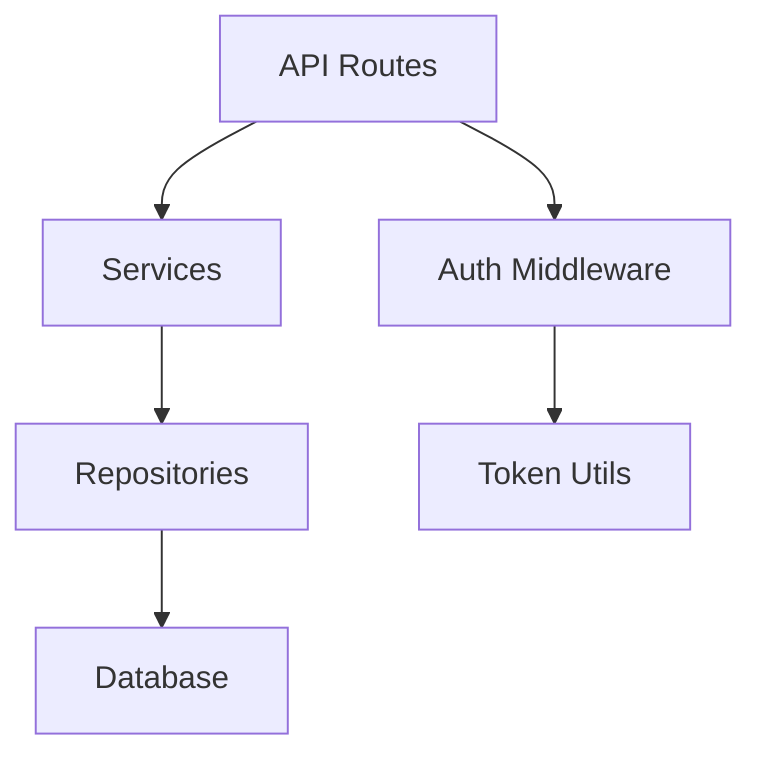

Generate human-readable architecture documentation in `docs/CODEMAPS/`.

Usage: `/update-codemaps [scope]`

Arguments: $ARGUMENTS

## Scope Options

- `all` (default): Generate all three codemap files
- `imports`: Only import/dependency graph
- `exports`: Only public API surface
- `architecture`: Only high-level architecture

## Generated Files

### 1. `docs/CODEMAPS/imports.md` — Dependency Graph

```markdown
# Import Map

## Module: src/auth/
### Internal Dependencies
- `src/auth/tokens.py` → `src/config.py` (settings)
- `src/auth/middleware.py` → `src/auth/tokens.py` (token validation)

### External Dependencies
- `jwt` (PyJWT 2.8+)
- `bcrypt` (3.2+)

### Circular Dependency Warnings
⚠ None detected

---

## Module: src/api/
### Internal Dependencies
- `src/api/routes.py` → `src/auth/middleware.py` (auth decorator)
- `src/api/routes.py` → `src/services/` (business logic)

### External Dependencies
- `fastapi` (0.100+)
- `pydantic` (2.0+)
```

### 2. `docs/CODEMAPS/exports.md` — Public API Surface

```markdown
# Public API Surface

## Module: src/auth/
### Functions
- `create_token(user_id: str, expiry: int) -> str` — Generate JWT token
- `verify_token(token: str) -> dict` — Validate and decode token

### Classes
- `AuthMiddleware` — FastAPI middleware for route protection

### Constants
- `TOKEN_EXPIRY_DEFAULT = 3600`

### Deprecation Notices
- ~~`old_verify()` — Use `verify_token()` instead (removed in v2.0)~~

---

## Module: src/api/
### Endpoints
- `POST /auth/login` → `src/api/auth_routes.py:login`
- `GET /users/{id}` → `src/api/user_routes.py:get_user`
```

### 3. `docs/CODEMAPS/architecture.md` — System Architecture

```markdown
# Architecture Overview

## Layer Diagram

```
┌─────────────────────────────────┐
│           API Layer             │  src/api/
│  (Routes, Middleware, Schemas)  │
├─────────────────────────────────┤
│         Service Layer           │  src/services/
│     (Business Logic, Rules)     │
├─────────────────────────────────┤
│        Repository Layer         │  src/repositories/
│   (Data Access, ORM Queries)    │
├─────────────────────────────────┤
│         Infrastructure          │  src/config/, src/db/
│  (Config, DB, External APIs)    │
└─────────────────────────────────┘
```

## Module Relationships



## Key Boundaries
- API layer NEVER accesses repositories directly
- Services are framework-agnostic (no FastAPI imports)
- All DB access goes through repository layer
```

## Process

1. **Scan** codebase for source files (respecting .gitignore)
2. **Parse** imports/exports from each file
3. **Build** dependency graph
4. **Detect** circular dependencies and layer violations
5. **Generate** Markdown files with Mermaid diagrams
6. **Report** any architectural concerns found

## Relationship to project-index.sh

| Tool | Format | Purpose | When to Use |
|------|--------|---------|-------------|
| `project-index.sh` | JSON | Machine-readable, for sub-agents | Auto (hook) |
| `/update-codemaps` | Markdown | Human-readable, for developers | Manual |

The project index is lightweight and auto-generated. Codemaps are richer, human-friendly, and manually triggered.

## When to Use

- After significant architectural changes
- When onboarding new team members
- Before architecture review meetings
- Monthly maintenance alongside `/eval`
